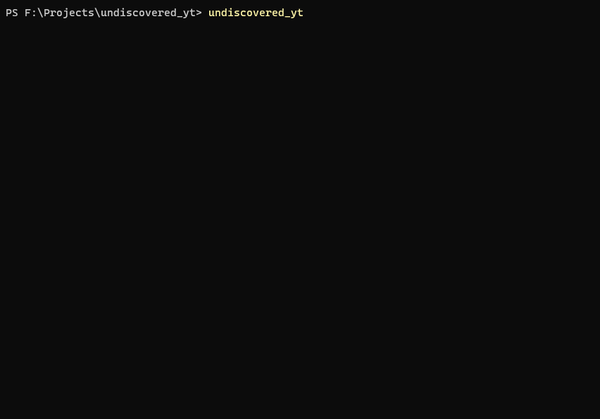

# Undiscovered YT

A simple CLI for finding random, never seen before YouTube videos

## Keybinds

| Key              | Description           |
|------------------|-----------------------|
| <kbd>↑/↓</kbd>   | Move cursor           |
| <kbd>Enter</kbd> | Proceed / Open        |
| <kbd>Space</kbd> | Toggle multiselect    |
| <kbd>1..9</kbd>  | Jump to index in list |
| <kbd>Esc</kbd>   | Exit app              |

## Credit

- The idea and some of the implementation came from the repo [jimxcds/ArbitraryProcurement](https://github.com/jimxcds/ArbitraryProcurement).
- The style of the CLI interface is largely inspired by `create-t3-app`.
